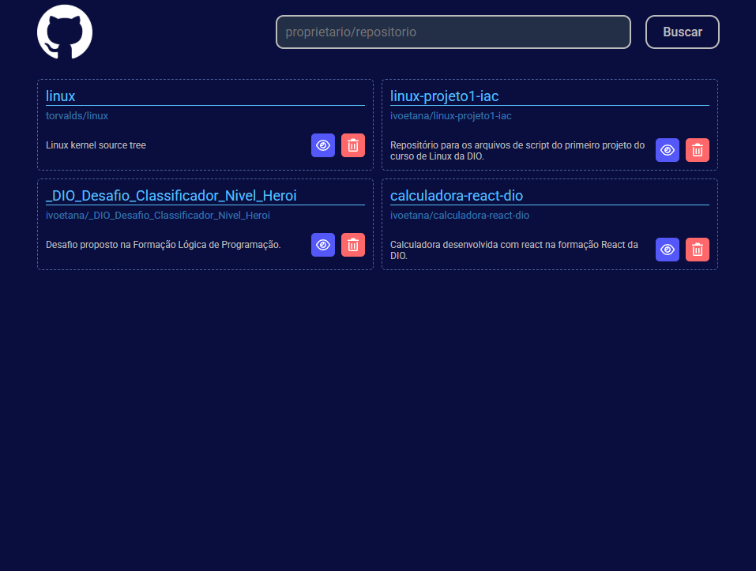

# 📂 Wiki GitHub - Listagem de Repositórios

Este é um projeto de listagem de repositórios do GitHub desenvolvido em **React** como parte do currículo da Digital Innovation One (DIO). A aplicação permite buscar e visualizar repositórios diretamente da API oficial do GitHub em uma interface moderna e organizada.

<p align="center">
  
</p>

---

## 🚀 Funcionalidades

* **Busca em Tempo Real:** Localiza repositórios específicos através da API do GitHub.
* **Listagem Dinâmica:** Exibe os repositórios encontrados em uma lista clara e intuitiva.
* **Interface Moderna:** Desenvolvida com **Styled Components** para um design limpo e responsivo.
* **Iconografia:** Implementação de ícones através do **FontAwesome** para melhor experiência do usuário.

---

## 🛠️ Tecnologias

* [React](https://reactjs.org/)
* [Styled Components](https://styled-components.com/)
* [FontAwesome](https://fontawesome.com/)
* [JavaScript (ES6+)](https://262.ecma-international.org/6.0/)

---

## ⚙️ Como executar o projeto

1.  Clone este repositório para o seu computador:
    ```bash
    git clone https://github.com/ivoetana/wiki_github_dio.git
    ```

2.  Acessar o diretório do projeto:
    ```bash
    cd wiki_github_dio
    ```

3.  Instalar todas as dependências:
    ```bash
    yarn install
    ```

4.  Executar a aplicação em modo de desenvolvimento:
    ```bash
    yarn start
    ```

A aplicação estará rodando em `http://localhost:3000`.

---

## 🌎 English Version

## 📂 Wiki GitHub - Repository Listing

A modern repository search tool built with **React** as part of the Digital Innovation One (DIO) bootcamp. This app allows users to find and list GitHub repositories using the official API.

### Features
* **Real-time Search:** Find repositories via GitHub API integration.
* **Dynamic Listing:** Clear display of searched projects.
* **Responsive Design:** Built with Styled Components.
* **Iconography:** Enhanced UI with FontAwesome icons.

### Technologies
* React
* Styled Components
* FontAwesome
* JavaScript (ES6+)

---

### ✍️ Autor
Desenvolvido por **Ivo Emanuel Tana**.
